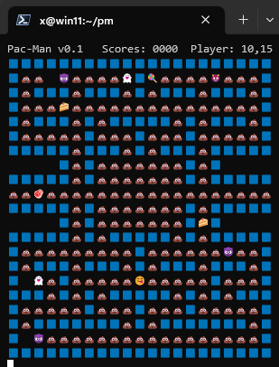

# Pac-Man 🎮

An emoji [Pac-Man](https://pacman.fandom.com/wiki/Pac-Man_(game)) game in your terminal emulator :)





## Get Started

Compile and run `pm.c`, that's it.

```bash
cc pm.c && ./a.out
```

## Features

- 🗺️ Custom map
- 🐛 Buggy :)

## LICENSE

Not licensed.
